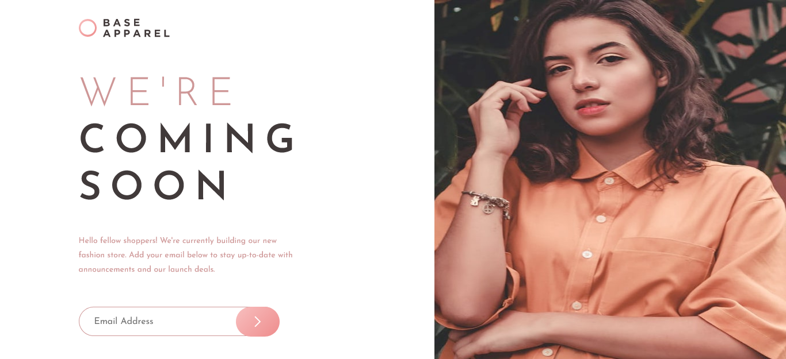

# Frontend Mentor - Base Apparel coming soon page solution

This is a solution to the [Base Apparel coming soon page challenge on Frontend Mentor](https://www.frontendmentor.io/challenges/base-apparel-coming-soon-page-5d46b47f8db8a7063f9331a0). Frontend Mentor challenges help you improve your coding skills by building realistic projects.

## Table of contents

- [Overview](#overview)
  - [The challenge](#the-challenge)
  - [Screenshot](#screenshot)
  - [Links](#links)
- [My process](#my-process)
  - [Built with](#built-with)
  - [What I learned](#what-i-learned)
- [Author](#author)
- [Acknowledgments](#acknowledgments)

## Overview

### The challenge

Users should be able to:

- View the optimal layout for the site depending on their device's screen size
- See hover states for all interactive elements on the page
- Receive an error message when the `form` is submitted if:
  - The `input` field is empty
  - The email address is not formatted correctly

### Screenshot



### Links

- Solution URL: [Frontend Mentor]()
- Live Site URL: [Github Pages]()

## My process

### Built with

<p align="left">


</p>

### What I learned

I learned `css
 object-fit:cover;` stretches the image too much and decided use `css object-fit: fill` instead. I created HTML input placeholder attribute with JavaScript.

```css
.showcase img {
  width: 100%;
  max-height: 30rem;
  object-fit: fill;
  height: auto;
}
```

```js
document.getElementById("email__input").placeholder = "Email Address";
```

## Author

<p align="left">
<a href="https://www.frontendmentor.io/profile/bccpadge">

</a>
<a href="https://github.com/bccpadge">

 </a>
<a href="https://www.linkedin.com/in/rebecca-padgett23">

</a>

</p>

## Acknowledgments

[Base Apparel Coming Soon page (custom version)](https://www.frontendmentor.io/solutions/base-apparel-coming-soon-page-custom-version-2iseDwyZc2) - This solution inspired me to implement accessibility within the JavaScript code.
